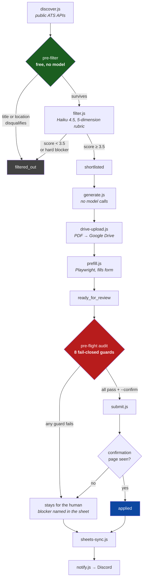
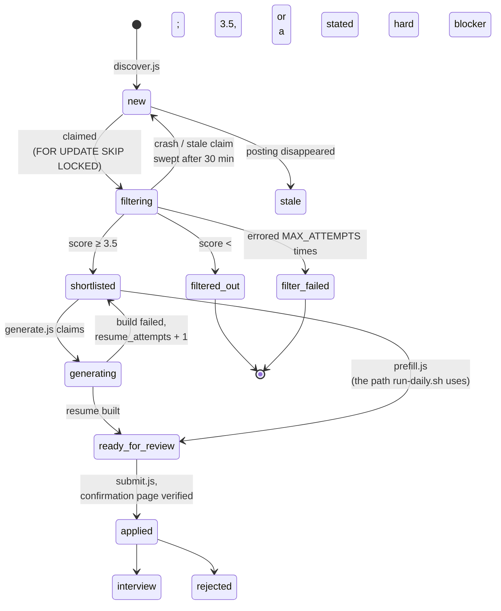
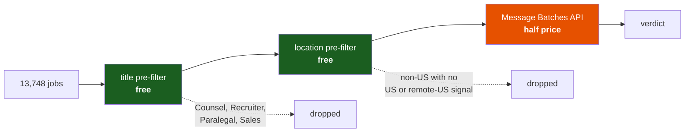
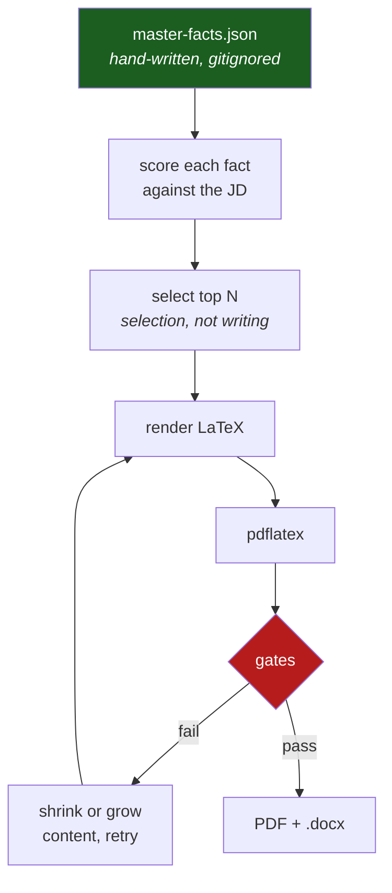
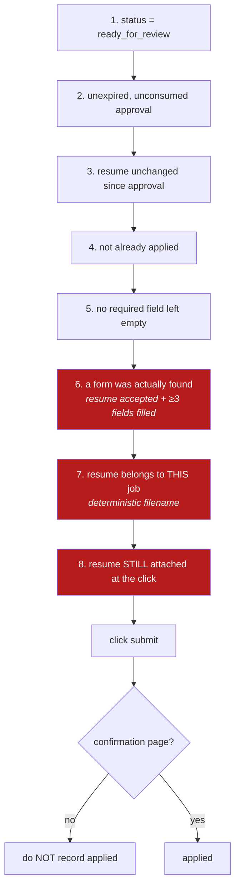
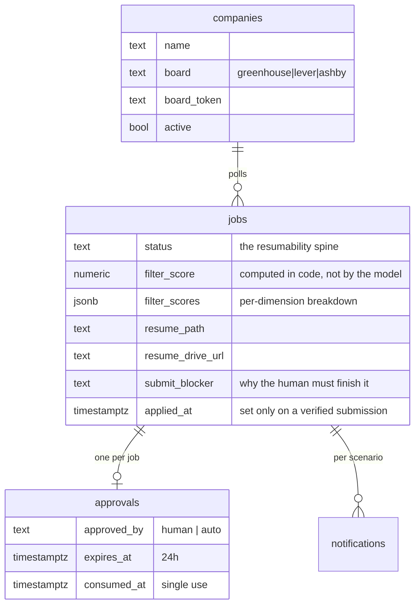

# jobagent — architecture

An unattended job-application pipeline. It discovers postings from public ATS
APIs, scores them against a hand-written facts file, builds a tailored resume,
fills the employer's form, and stops at a human approval gate.

It runs on a 2015 iMac: headless Ubuntu 24.04, 4-core Skylake i5, no usable GPU,
wifi only. **That constraint shapes every decision below** — the box drops its
connection regularly, so any stage that cannot be killed mid-run and restarted
safely is a design flaw, not an inconvenience.

---

## Pipeline



Every stage claims work, does **one unit**, commits, and moves on. A crash loses
at most the in-flight item, never a written verdict.

---

## Job status machine

`status` on the `jobs` table is the resumability spine. Each stage claims rows in
one status and commits them into the next.



> **Note:** `generate.js` has a pipeline mode that lands jobs directly on
> `ready_for_review`, but `run-daily.sh` deliberately does **not** use it —
> `prefill.js` owns that transition. Swapping them would silently skip form
> prefill and ask the human to review forms nobody filled.

---

## Cost control

The expensive stage is the model filter. Three layers sit in front of it, applied
in order:



The two free filters eliminate **more than half the corpus** before a model sees
anything. Both derive from the candidate's own `targets` block — a Bengaluru
posting is a rejection the facts file already implies, and paying ~2,700 tokens
to restate it is waste.

Both fail **open**: a job is dropped only on an unambiguous signal. A false
negative here is a job silently never applied to, which is worse than a wasted
call.

**Not used:** prompt caching (the system prompt is ~860 tokens against Haiku's
4,096-token minimum cacheable prefix — a breakpoint would be a silent no-op), and
local inference (an 8B model on this CPU runs ~2–3 min/job, ~30 hours for the
backlog, on the same 4 cores `pdflatex` needs).

---

## Resume generation — no model calls



Every bullet must map to an `id` in `master-facts.json`. That turns "write me a
resume" into a **selection problem**, so nothing can be invented — there is
nowhere for an invention to come from.

Gates, all mechanical, all run against the compiled PDF:

| Gate | Check |
|---|---|
| Fact coverage | every selected fact's text survives into the PDF |
| ATS parse | contact details survive `pdftotext` |
| Section headings | extract contiguously (`SUMMARY`, not `S UMMARY`) |
| Page count | exactly one |
| Overfull hbox | none — catches text run off the margin |
| JD keyword coverage | ≥ 70% of owned terms the posting names |
| Page fill | ghostscript bbox — bottom ink within ~10pt of the margin |

---

## The submit guards

`submit.js` is the only script that does something irreversible. Eight
fail-closed guards, in order:



Guards 6, 7 and 8 exist because of real failures, and each is the same lesson:
**evidence that was true when gathered, and not when it mattered.**

- **Guard 6** — the audit passed on a page with *no form on it*. "No required
  field is empty" is trivially true when there are no fields. Greenhouse was
  302-redirecting to a job description page.
- **Guard 7** — a resume tailored for a different company was about to be
  attached. Every other guard passed; nothing verified the document matched
  the job.
- **Guard 8** — the resume was attached during filling and gone by the click.
  Greenhouse uploads to S3 asynchronously and tracks the file in JS state, not
  the DOM, so `setInputFiles` resolving proved nothing.

`--auto` replaces **guard 2 only**. The audit becomes the approver, an approval
row is still written as `approved_by='auto'`, and everything else stands.

---

## Board support

| Board | Discovery | Resume | Prefill | Auto-submit |
|---|---|---|---|---|
| **Greenhouse** | ✅ | ✅ | ✅ | ✅ 2/3 dry runs passed |
| **Lever** | ✅ | ✅ | ⚠️ partial | ❌ 0/3 |
| **Ashby** | ✅ | ✅ | ⚠️ partial | ❌ 0/3 |

- **Greenhouse** must use the `/embed/job_app` endpoint. The obvious board URL
  302-redirects to the employer's own careers page, which has no form.
- **Lever**'s "Current location" is a geocoded autocomplete: the visible input is
  cosmetic and the real value lives in a hidden `selectedLocation` field set only
  by clicking a suggestion, which never renders headless.
- **Ashby** asks free-text essay questions ("describe your proudest Android
  feature"). Those cannot be automated without inventing content, which the
  never-invent rule forbids. They pause for the human by design.

Anything the agent cannot submit still gets a tailored resume, a Drive link, and
a tracking-sheet row marked **`YOU — apply by hand`** with the exact blocking
question named.

---

## Data model



Postgres is the source of truth. The tracking sheet and Discord are views.

---

## Hard rules

These are non-negotiable and encoded in the code, not just documented:

1. **Never invent resume content.** Every bullet maps to a fact id.
2. **Never submit without approval.** The pipeline prepares everything and stops.
3. **Screening questions are legal attestations.** Answered once by the human in
   `master-facts.json`, reused verbatim, never inferred. A US work-authorisation
   answer is never given to a question about another country.
4. **Deterministic gates alongside any model score.** LLM-score-only loops
   converge on keyword stuffing.
5. **Everything idempotent and resumable.** The box drops wifi.
6. **Public board APIs only.** Respect robots.txt and ToS.

---

## Running it

```bash
psql -d jobagent -f schema.sql          # idempotent
psql -d jobagent -f companies-seed.sql  # 141 companies
cp master-facts.example.json master-facts.json   # then fill it in
node validate-facts.js

set -a; . ./.env; set +a
node filter.js --prefilter-only              # free, no API calls
node filter.js --limit 300 --batch --board greenhouse --spread
./run-daily.sh                                # full pass, no submissions
AUTO_SUBMIT=1 ./run-daily.sh                  # sends real applications
```

`--spread` round-robins the claim across companies. Without it, a capped run on a
141-company watchlist spends the whole budget on whichever company sits at the
front of the id ordering.
