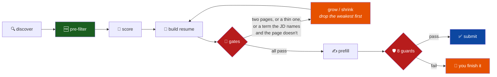
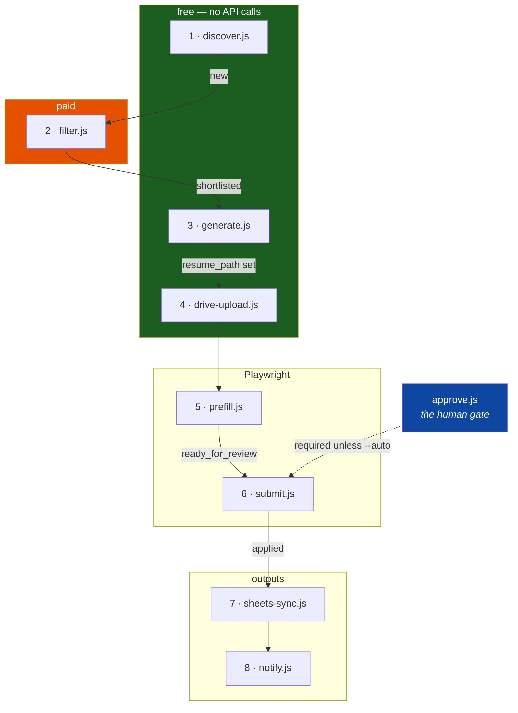
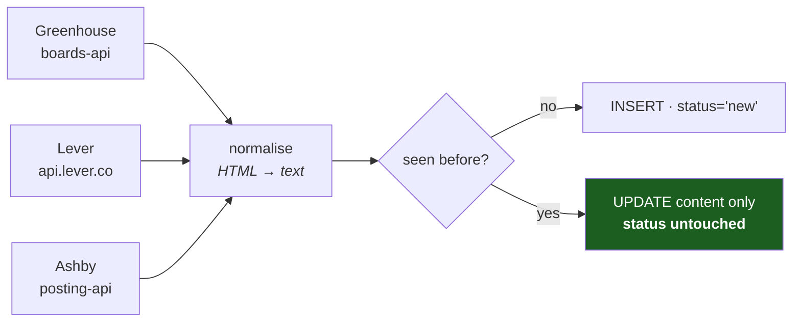
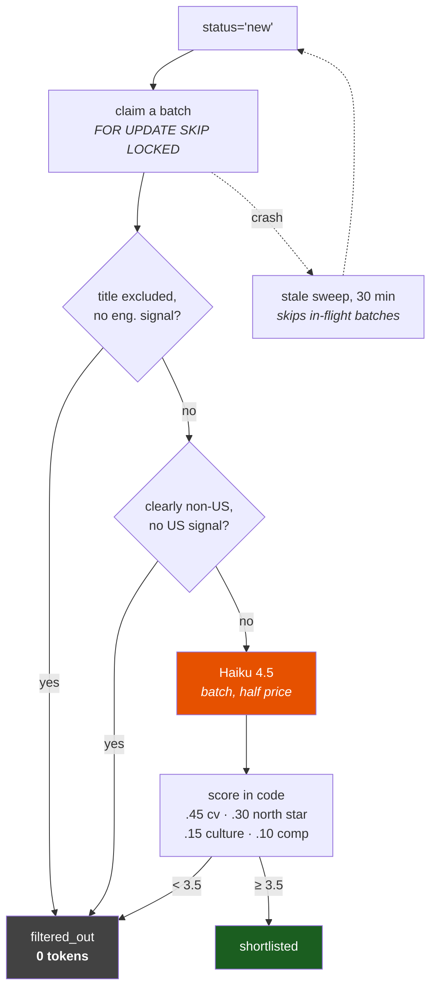
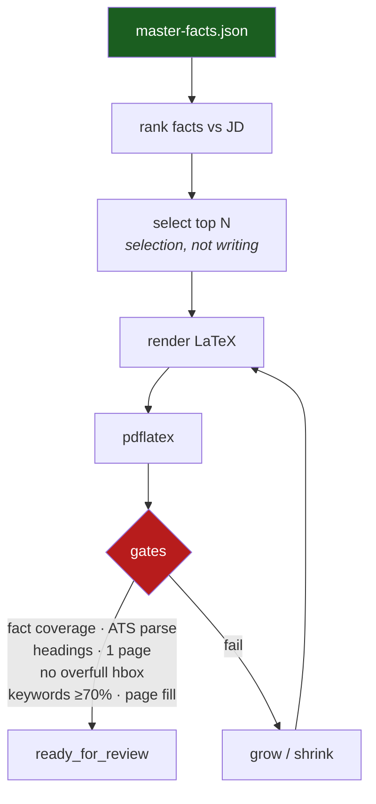
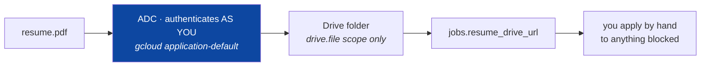
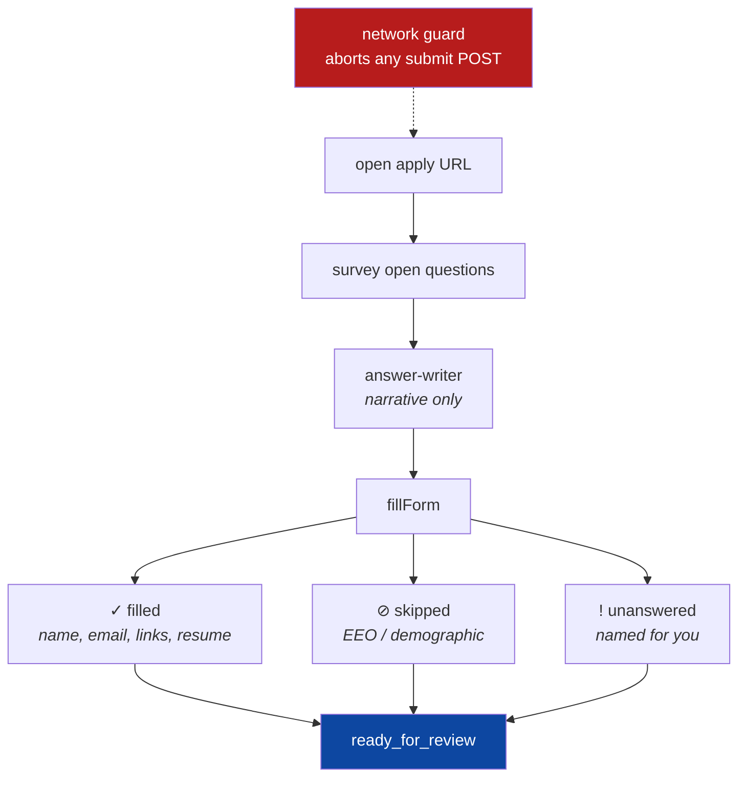
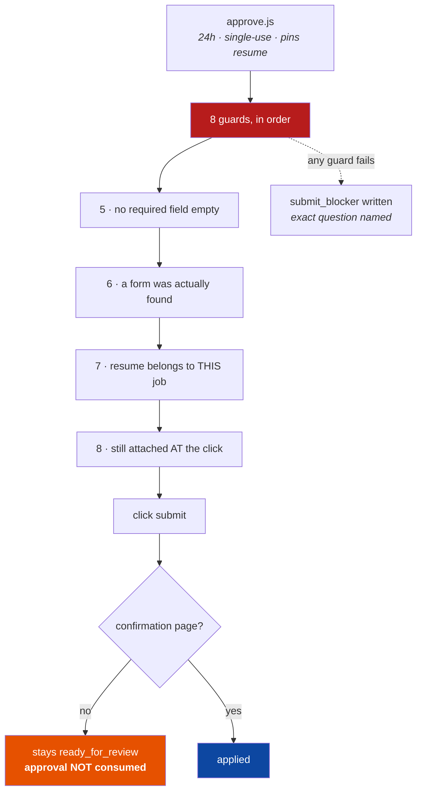
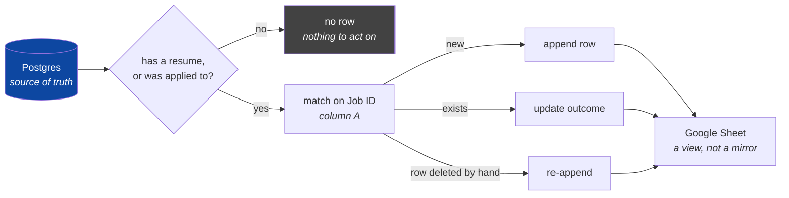
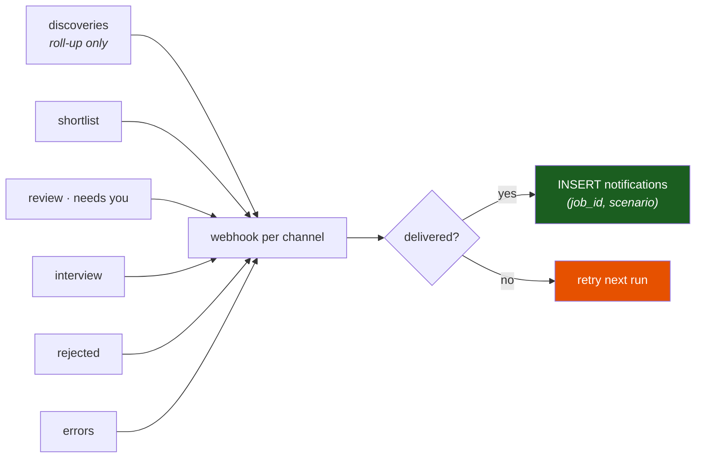

<div align="center">

# 🎯 jobagent

### An unattended job-application pipeline that knows when *not* to apply

*Running 24/7 on a 2015 iMac in a closet.*

<br/>


<br/>

| 🏢 Companies | 📋 Jobs indexed | 🆓 Filtered free | 🛡️ Submit guards | 🤖 Model calls per resume |
|:---:|:---:|:---:|:---:|:---:|
| **141** | **13,748** | **>50%** | **8** | **0** |

</div>

---

## What it does

Every morning it pulls new postings from 141 companies' **public ATS APIs**, scores
them against a hand-written facts file, builds a resume tailored to each one,
fills in the employer's form — and then stops and asks a human.



No PDF leaves that loop until every gate passes: one page, filled to the bottom
margin, every cited fact still extractable, and at least 70% of the terms the
posting names that you actually own. It re-compiles up to 16 times to get there.
A build that never satisfies them keeps its `shortlisted` status and its reason,
rather than inventing a failure state — you can still apply to that one by hand.

> 📐 **[Full architecture, with diagrams →](ARCHITECTURE.md)**

---

## Why it's built this way

<table>
<tr>
<td width="33%" valign="top">

### 🧱 It cannot lie

Every resume bullet must map to an `id` in a hand-written facts file. That turns
*"write me a resume"* into a **selection problem**, not a writing problem.

The resume generator makes **zero model calls** — there is nowhere for an
invention to come from. Where a model *does* write prose, it writes from the same
facts and is checked against them.

</td>
<td width="33%" valign="top">

### 🛑 It refuses

An application cannot be unsent, so the submitter has **8 fail-closed guards** and
records nothing as `applied` without a verified confirmation page.

Anything it can't finish is handed to you with the **exact blocking question**
named.

</td>
<td width="33%" valign="top">

### 💸 It's cheap

Two deterministic filters — job title and location — eliminate **more than half**
the corpus before a model sees anything.

You don't need an LLM to notice that *"Corporate Paralegal, EMEA"* isn't a backend
role in California.

</td>
</tr>
</table>

---

## The eight stages

One pass of `run-daily.sh` is eight stages. Each one claims work in a single
status, does **one unit**, commits, and moves on — so any stage can be killed
mid-run and restarted without losing a written result. The `status` column is
what makes that true.

> These are the eight **stages**. The eight **guards** further down are a
> different eight, and they all live inside stage 6.



---

### 1 · `discover.js` — find the postings

Polls the public board API of every active company on the watchlist, normalises
each posting, and upserts it deduped on `(company_id, external_id)`. Public
documented endpoints only: no scraping, no authenticated calls, no LinkedIn. It
identifies itself in its user agent and waits 1.5s between companies.

The upsert refreshes content but **never touches `status`**. Rediscovery
therefore cannot resurrect a job the filter already decided on, or make you pay
to classify the same posting twice. One bad board doesn't abort the run.



---

### 2 · `filter.js` — decide what's worth applying to

The only stage that costs money, so three layers sit in front of the model. A
free title check, a free location check, then the Message Batches API at half
price. The model returns **per-dimension scores only** — the global is a
weighted average computed in code, because a score-only loop drifts toward
whatever the model likes.

Both free filters fail **open**: a job is dropped only on an unambiguous signal,
since a false negative is a job silently never applied to.



---

### 3 · `generate.js` — build the resume

**Zero model calls.** Every bullet must map to an `id` in the facts file, which
makes tailoring a selection problem: rank facts against the JD, keep the
strongest, emit their text verbatim. Nothing is rewritten, so nothing can be
invented.

Then it compiles and checks its own output. If a gate fails the PDF is not
accepted, and the fill loop grows or shrinks content to reach the bottom margin.



---

### 4 · `drive-upload.js` — put the PDF somewhere you can reach it

Every generated resume goes to a Drive folder so anything the agent can't submit
can still be applied to by hand from a phone. Auth is split for a reason worth
remembering: Drive uploads run **as you**, because a service account has no
storage quota on a personal account and can't own a file outside a Shared Drive.



---

### 5 · `prefill.js` — fill the employer's real form

A real browser opens the actual application form and fills what can be filled
truthfully. **It cannot submit**: no code path clicks a submit control, and a
network-layer route blocks a same-origin submission POST even if some future
refactor tried.

What it deliberately skips: demographic and EEO questions, and any screening
question with no pre-written answer.



---

### 6 · `submit.js` — the only irreversible step

Dry run by default; `--confirm` is required to send. `approve.js` is a separate
command on purpose — approving and sending are two decisions, and one flag that
does both is how you send by accident. An approval covers one job, expires in
24h, is single-use, and pins the resume file.

Eight fail-closed guards run before the click, and a confirmation page is
required after it. `--auto` replaces **guard 2 only**; every other guard stands.



---

### 7 · `sheets-sync.js` — the tracker

Every job that got a **tailored resume**, not only the applied ones — otherwise
a per-job PDF sits in Drive with no row pointing at it, which defeats the reason
the upload stage exists. `Applied` and `How` stay blank until a real submission,
so the two are still distinguishable at a glance. A filtered-out job with a
resume is a debugging artefact and never gets a row.

Postgres stays the source of truth; the sheet is a view you can annotate.
Reconciliation is by **Job ID in column A**, not by remembered row number, so
sorting or deleting rows by hand cannot corrupt the mapping.



---

### 8 · `notify.js` — tell the human

Six scenarios, one Discord channel each, anything unset falling back to a single
webhook. Every digest is a to-do list, not a receipt. A job is recorded in
`notifications` **only after** the webhook carrying it succeeded, so a dead
webhook re-sends next run instead of silently dropping jobs.



---

## Two kinds of question

Behind every free-text box on an application form sits one of two things, and
they are not the same kind of thing at all.

| | **Attestation** | **Narrative** |
|---|---|---|
| Looks like | *"Are you authorized to work in the US?"* · *"Have you been convicted of a felony?"* · *"Expected salary?"* | *"Why do you want to work here?"* · *"Describe a project you're proud of"* |
| Is | a statement of fact to an employer, actionable and verifiable | marketing prose about work you actually did |
| Getting it wrong is | a false statement on a job application | badly written |
| So it comes from | `master-facts.json` verbatim, or the application **pauses** | the model, from the same verified facts the resume is built from |

`lib/answer-writer.js` writes the second and refuses the first. The split is
matched deterministically *before* the model is called, and **defaults to
refusing** when unsure — a false positive costs one paused application that you
finish by hand; a false negative is a fabricated legal attestation sent under
your name.

The generated prose is then held to the same standard as the resume: every
claim, number, and employer name in it must trace back to a verified fact, and
text that fails those checks is discarded rather than sent.

Cover letters are grounded the same way, but run on demand rather than as part of
the nightly pass — a letter that fails its grounding check is never written at
all:

```bash
node cover-letter.js --job-id N --dry-run   # print it, write nothing
node cover-letter.js --pipeline --limit 5   # every job awaiting review
```

Set `NO_GENERATED_ANSWERS=1` to turn generated answers off entirely and fill
every text box by hand.

---

## The guards

Eight fail-closed checks stand between a prepared application and a sent one.
They run in order, and any one of them refuses the whole send.

| # | Guard | What it requires |
|:---:|---|---|
| 1 | **Right state** | The job is at `ready_for_review`. Not shortlisted, not half-built. |
| 2 | **A live approval** | An unexpired, unconsumed approval exists for this job id. |
| 3 | **The approved resume** | The file on disk is the one that was approved. Rebuild it and the approval no longer describes what would be sent. |
| 4 | **Not already sent** | `applied_at` is null. An application cannot be unsent, so it is never sent twice. |
| 5 | **Nothing left empty** | After filling, no required control on the live form is still blank. The DOM is re-read rather than trusting what the fill step reported. |
| 6 | **A form was actually found** | A resume upload was accepted and at least 3 fields were filled. |
| 7 | **The resume belongs to this job** | The filename matches what the generator builds for *this* company, title and job id. |
| 8 | **Still attached at the click** | The filename is visible on the page immediately before clicking, with no required-field error showing. |

Then one more after the click: a **confirmation page** must be detected, or the
job stays at `ready_for_review` with its approval intact. Recording `applied`
without proof is the worst outcome available, because the job is never retried
and a silently failed submission becomes one you never notice.

`--auto` replaces **guard 2 only**. The audit becomes the approver, an approval
row is still written as `approved_by='auto'`, and the other seven stand
untouched.

### The three that were paid for

Guards 6, 7 and 8 exist because of real failures, and they are the same lesson
three times.

**6 — the audit passed on a page with no form on it.** Some employers redirect
the board URL to their own careers site, which is a description page with an
apply button and no inputs. Zero fields filled, zero fields empty, audit clean.
"No required field is empty" is trivially true when there are no fields.

**7 — a resume tailored for a different company was about to be attached.**
Every other guard passed it. Nothing in the system was checking that the
document matched the job, because `resume_path` is just a string.

**8 — the upload vanished between filling and clicking.** The board uploads to
S3 and then removes the file input from the DOM, tracking the file in its own
JS state. Guard 6 proved the resume was attached minutes and nineteen fields
earlier. A real submission was rejected with "Resume/CV is required" while every
one of our guards had passed.

All three: **evidence that was true when gathered, and not when it mattered.**

---

## Board support

| Board | Discover | Resume | Prefill | Auto-submit |
|---|:---:|:---:|:---:|:---|
| **Greenhouse** | ✅ | ✅ | ✅ | ⚠️ &nbsp;fills and audits; nothing sent yet |
| **Lever** | ✅ | ✅ | ⚠️ | ❌ &nbsp;geocoded location field never renders headless |
| **Ashby** | ✅ | ✅ | ⚠️ | ❓ &nbsp;untested since narrative answers landed |

**Nothing has been submitted yet.** 35 Greenhouse forms have been filled and
audited, every one of them a dry run; no job has reached `applied` and no
confirmation page has been verified. The submit path is built and guarded, not
proven.

Only Greenhouse has been exercised at all. Lever's blocker is structural: the
visible "Current location" input is cosmetic, the real value lives in a hidden
field set only by clicking a suggestion, and the dropdown returns nothing in
headless Chromium — so the audit correctly refuses. Ashby was previously blocked
by its free-text essay questions; `lib/answer-writer.js` is built for exactly
those, but no Ashby job has reached prefill yet, so the box stays a question mark
until one does.

One Greenhouse caveat worth naming: some employers 302 the board URL to their own
careers site, which is a description page with an *"Apply for this role"* button
and **no form on it**. Guard 6 refuses those rather than reporting a vacuous pass.
Reaching the real form means following that button into whatever the employer
hosts behind it, which isn't built.

Anything the agent can't submit still earns a tailored resume, a Drive link, and a
tracker row marked **`YOU — apply by hand`**.

---

## Quick start

```bash
# 1. database, schema, watchlist (the last two are idempotent)
createdb jobagent
psql -d jobagent -f schema.sql
psql -d jobagent -f companies-seed.sql

# 2. your history — this file is yours and is gitignored
cp master-facts.example.json master-facts.json
$EDITOR master-facts.json
node validate-facts.js

# 3. credentials — every variable is documented in .env.example
cp .env.example .env && chmod 600 .env
$EDITOR .env            # ANTHROPIC_API_KEY, Discord webhook, Google IDs
set -a; . ./.env; set +a

# 4. find work — free, no API calls
node discover.js
node filter.js --prefilter-only

# 5. score a slice, spread across companies
node filter.js --limit 300 --batch --board greenhouse --spread

# 6. full pass — prepares everything, submits nothing
./run-daily.sh
```

<details>
<summary><b>Sending real applications</b></summary>

<br/>

Submission is **off by default**. An unmodified cron entry never sends anything.

```bash
AUTO_SUBMIT=1 ./run-daily.sh     # capped: 3 per run, 2 per company
```

Even switched on, it only submits what the pre-flight audit fully clears — every
required field populated and every question already answered from your facts
file. Everything else stops at `ready_for_review`.

For a single job, watched:

```bash
node submit.js --job-id N --auto              # dry run: fills, audits, sends nothing
node submit.js --job-id N --auto --confirm    # actually submits
```

</details>

---

## Hard rules

These are enforced in code, not just documented.

1. **Never invent resume content.** Every bullet maps to a fact id.
2. **Never submit without approval.** The pipeline prepares everything and stops.
3. **Attestations are answered by you, never by a model.** Work authorisation,
   sponsorship, criminal history, protected characteristics, clearance, salary:
   answered once in your facts file, reused verbatim, never inferred — a US
   work-authorisation answer is never given to a question about another country.
   The model may write *narrative* answers and cover letters from verified facts;
   the attestation/narrative split is matched in code and fails closed.
4. **Deterministic gates alongside any model score.** Score-only loops converge on
   keyword stuffing.
5. **Everything idempotent and resumable.** The box drops wifi.
6. **Public board APIs only.** Respect robots.txt and ToS.

---

## Stack

**Node 22** · **Postgres 16** · **Playwright** · **LaTeX** (`pdflatex`, ATS-gated)
· **Claude Haiku 4.5** (scoring) · **Claude Sonnet 5** (narrative answers and
cover letters — never resumes, never attestations) · **Google Drive + Sheets** ·
**Discord**

Runs headless on Ubuntu 24.04 — 4-core Skylake i5, no GPU, wifi only.

---

## License

Released under the **MIT License** — see [`LICENSE`](LICENSE).

```
Copyright (c) 2026 Dileep Kumar Sharma

Permission is hereby granted, free of charge, to any person obtaining a copy
of this software and associated documentation files (the "Software"), to deal
in the Software without restriction, including without limitation the rights
to use, copy, modify, merge, publish, distribute, sublicense, and/or sell
copies of the Software, and to permit persons to whom the Software is
furnished to do so, subject to the following conditions:

The above copyright notice and this permission notice shall be included in all
copies or substantial portions of the Software.

THE SOFTWARE IS PROVIDED "AS IS", WITHOUT WARRANTY OF ANY KIND, EXPRESS OR
IMPLIED, INCLUDING BUT NOT LIMITED TO THE WARRANTIES OF MERCHANTABILITY,
FITNESS FOR A PARTICULAR PURPOSE AND NONINFRINGEMENT. IN NO EVENT SHALL THE
AUTHORS OR COPYRIGHT HOLDERS BE LIABLE FOR ANY CLAIM, DAMAGES OR OTHER
LIABILITY, WHETHER IN AN ACTION OF CONTRACT, TORT OR OTHERWISE, ARISING FROM,
OUT OF OR IN CONNECTION WITH THE SOFTWARE OR THE USE OR OTHER DEALINGS IN THE
SOFTWARE.
```

The scoring rubric is adapted from [career-ops](https://github.com/santifer/career-ops) (MIT), attributed in `filter.js`.

<div align="center">
<br/>
<sub>Built to solve my own problem. An old iMac earning its keep.</sub>
</div>
