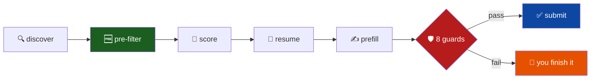

<div align="center">

# 🎯 jobagent

### An unattended job-application pipeline that knows when *not* to apply

*Running 24/7 on a 2015 iMac in a closet.*

<br/>


<br/>

| 🏢 Companies | 📋 Jobs indexed | 🆓 Filtered free | 🛡️ Submit guards | 🤖 Model calls per resume |
|:---:|:---:|:---:|:---:|:---:|
| **141** | **13,748** | **>50%** | **8** | **0** |

</div>

---

## What it does

Every morning it pulls new postings from 141 companies' **public ATS APIs**, scores
them against a hand-written facts file, builds a resume tailored to each one,
fills in the employer's form — and then stops and asks a human.



> 📐 **[Full architecture, with diagrams →](ARCHITECTURE.md)**

---

## Why it's built this way

<table>
<tr>
<td width="33%" valign="top">

### 🧱 It cannot lie

Every resume bullet must map to an `id` in a hand-written facts file. That turns
*"write me a resume"* into a **selection problem**, not a writing problem.

The generator makes **zero model calls** — there is nowhere for an invention to
come from.

</td>
<td width="33%" valign="top">

### 🛑 It refuses

An application cannot be unsent, so the submitter has **8 fail-closed guards** and
records nothing as `applied` without a verified confirmation page.

Anything it can't finish is handed to you with the **exact blocking question**
named.

</td>
<td width="33%" valign="top">

### 💸 It's cheap

Two deterministic filters — job title and location — eliminate **more than half**
the corpus before a model sees anything.

You don't need an LLM to notice that *"Corporate Paralegal, EMEA"* isn't a backend
role in California.

</td>
</tr>
</table>

---

## The guards

Eight fail-closed checks stand between a prepared application and a sent one.
Three of them exist because of real failures:

| # | Guard | Why it exists |
|:---:|---|---|
| 6 | **A form was actually found** | The audit passed on a page with *no form on it*. "No required field is empty" is trivially true when there are no fields. |
| 7 | **The resume belongs to this job** | A resume tailored for a *different company* was about to be attached. Every other guard passed. |
| 8 | **Still attached at the click** | The upload vanished between filling and clicking — the board tracks it in JS state, not the DOM. |

All three are the same lesson: **evidence that was true when gathered, and not
when it mattered.**

---

## Board support

| Board | Discover | Resume | Prefill | Auto-submit |
|---|:---:|:---:|:---:|:---|
| **Greenhouse** | ✅ | ✅ | ✅ | ✅ &nbsp;works |
| **Lever** | ✅ | ✅ | ⚠️ | ❌ &nbsp;geocoded location field never renders headless |
| **Ashby** | ✅ | ✅ | ⚠️ | ❌ &nbsp;free-text essay questions |

Anything the agent can't submit still earns a tailored resume, a Drive link, and a
tracker row marked **`YOU — apply by hand`**.

---

## Quick start

```bash
# 1. schema + watchlist (both idempotent)
psql -d jobagent -f schema.sql
psql -d jobagent -f companies-seed.sql

# 2. your history — this file is yours and is gitignored
cp master-facts.example.json master-facts.json
$EDITOR master-facts.json
node validate-facts.js

# 3. credentials
cp .env.example .env    # ANTHROPIC_API_KEY, Discord webhooks, Google IDs
set -a; . ./.env; set +a

# 4. find work — free, no API calls
node discover.js
node filter.js --prefilter-only

# 5. score a slice, spread across companies
node filter.js --limit 300 --batch --board greenhouse --spread

# 6. full pass — prepares everything, submits nothing
./run-daily.sh
```

<details>
<summary><b>Sending real applications</b></summary>

<br/>

Submission is **off by default**. An unmodified cron entry never sends anything.

```bash
AUTO_SUBMIT=1 ./run-daily.sh     # capped: 3 per run, 2 per company
```

Even switched on, it only submits what the pre-flight audit fully clears — every
required field populated and every question already answered from your facts
file. Everything else stops at `ready_for_review`.

For a single job, watched:

```bash
node submit.js --job-id N --auto              # dry run: fills, audits, sends nothing
node submit.js --job-id N --auto --confirm    # actually submits
```

</details>

---

## Hard rules

These are enforced in code, not just documented.

1. **Never invent resume content.** Every bullet maps to a fact id.
2. **Never submit without approval.** The pipeline prepares everything and stops.
3. **Screening questions are legal attestations.** Answered once by you, reused
   verbatim, never inferred — a US work-authorisation answer is never given to a
   question about another country.
4. **Deterministic gates alongside any model score.** Score-only loops converge on
   keyword stuffing.
5. **Everything idempotent and resumable.** The box drops wifi.
6. **Public board APIs only.** Respect robots.txt and ToS.

---

## Stack

**Node 22** · **Postgres 16** · **Playwright** · **LaTeX** (`pdflatex`, ATS-gated)
· **Claude Haiku 4.5** (scoring only) · **Google Drive + Sheets** · **Discord**

Runs headless on Ubuntu 24.04 — 4-core Skylake i5, no GPU, wifi only.

---

## License

Released under the **MIT License** — see [`LICENSE`](LICENSE).

```
Copyright (c) 2026 Dileep Kumar Sharma

Permission is hereby granted, free of charge, to any person obtaining a copy
of this software and associated documentation files (the "Software"), to deal
in the Software without restriction, including without limitation the rights
to use, copy, modify, merge, publish, distribute, sublicense, and/or sell
copies of the Software, and to permit persons to whom the Software is
furnished to do so, subject to the following conditions:

The above copyright notice and this permission notice shall be included in all
copies or substantial portions of the Software.

THE SOFTWARE IS PROVIDED "AS IS", WITHOUT WARRANTY OF ANY KIND, EXPRESS OR
IMPLIED, INCLUDING BUT NOT LIMITED TO THE WARRANTIES OF MERCHANTABILITY,
FITNESS FOR A PARTICULAR PURPOSE AND NONINFRINGEMENT. IN NO EVENT SHALL THE
AUTHORS OR COPYRIGHT HOLDERS BE LIABLE FOR ANY CLAIM, DAMAGES OR OTHER
LIABILITY, WHETHER IN AN ACTION OF CONTRACT, TORT OR OTHERWISE, ARISING FROM,
OUT OF OR IN CONNECTION WITH THE SOFTWARE OR THE USE OR OTHER DEALINGS IN THE
SOFTWARE.
```

The scoring rubric is adapted from [career-ops](https://github.com/santifer/career-ops) (MIT), attributed in `filter.js`.

<div align="center">
<br/>
<sub>Built to solve my own problem. An old iMac earning its keep.</sub>
</div>
